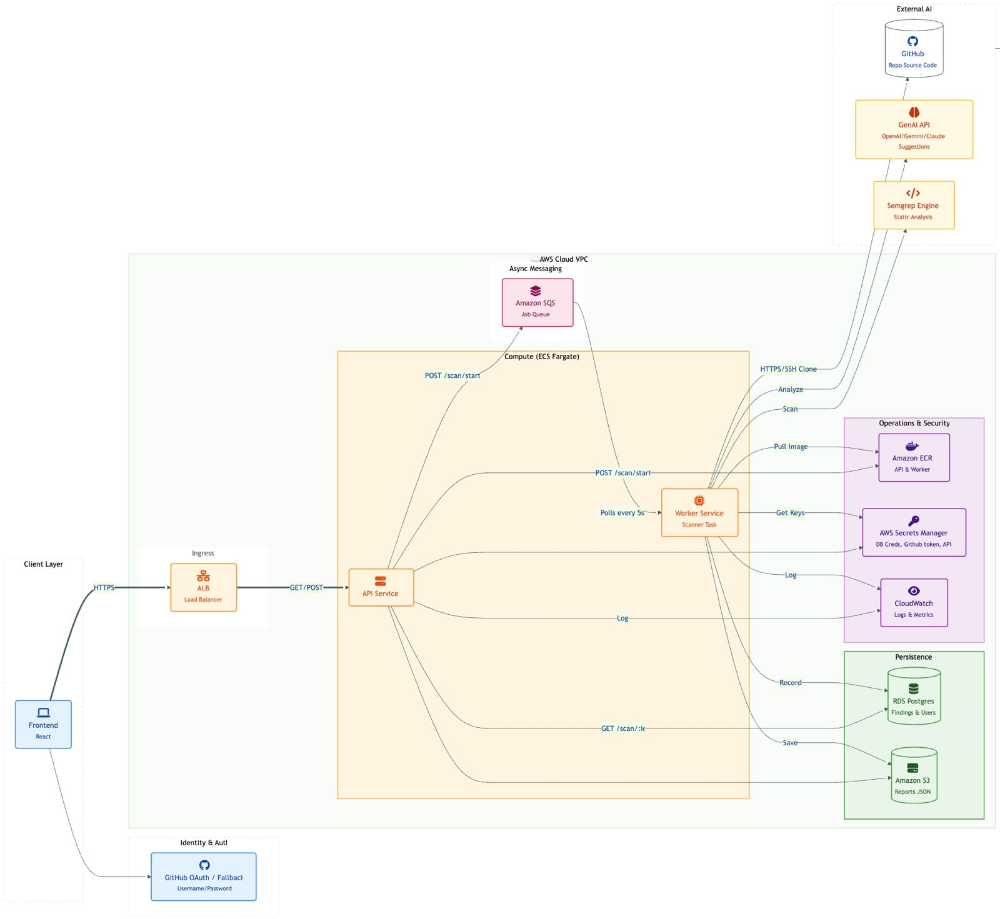
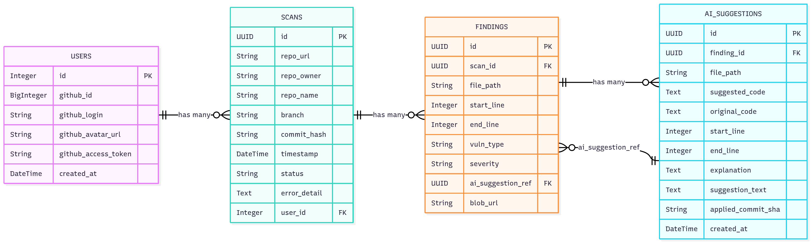
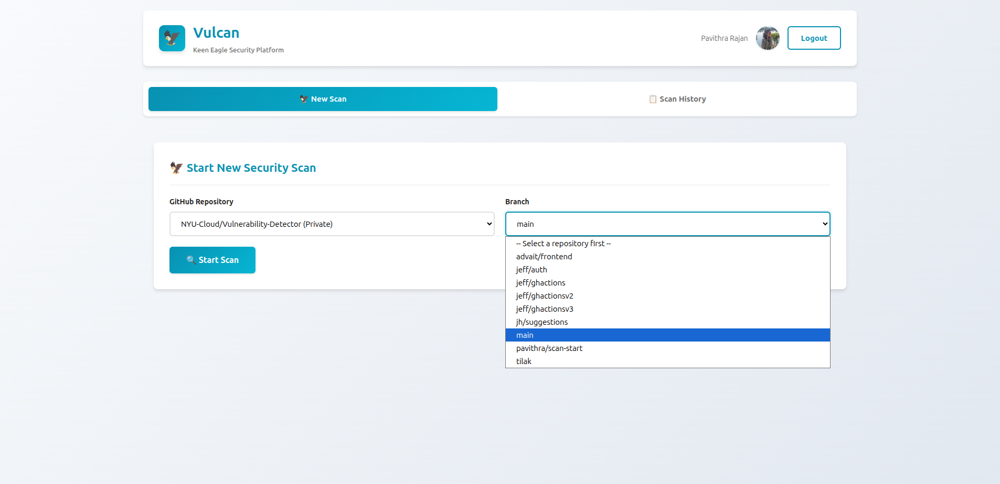
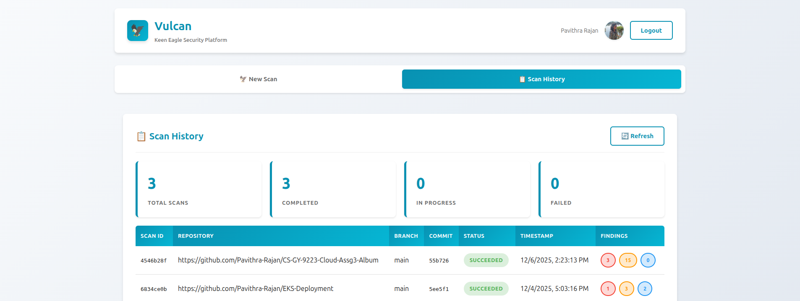

# Overview

This page contains details on  the **Problem Statement**, **Components & Architecture**, and **API Endpoints**.

---

## Problem Statement

VulCAN is a Vulnerability Code ANalyser that will allow users to submit GitHub repository URLs for security scanning. The application will analyze the code files within this repository for common vulnerabilities such as SQL injection, cross-site scripting (XSS), hardcoded credentials and more with Semgrep. Upon completion, it will generate a report highlighting potential security issues, the criticality levels and provide recommendations for fixing them using GenAI.

---

## Components & Architecture
### Architecture Diagram  

### ER Database Diagram  
 

### Components
- Frontend
- API Server  
- Worker Service on Fargate
- Database [RDS] - PostgreSQL
- External Integrations  
    - Semgrep
    - GenAI for suggestions
    - GitHub
- AWS Secrets Manager
- CDK for IaC
- ECR 
- S3 for frontend and Cloudfront for hosting

## Data Flow  
### Identity and Authentication with GitHub OAuth

- User clicks "Sign In with GitHub" on the frontend
- Frontend redirects to `/auth/github/login` on backend
- Backend initiates GitHub OAuth flow, redirecting user to GitHub
- User authorizes application on GitHub
- GitHub redirects back to backend callback URL with authorization code
- Backend exchanges code for access token and fetches user info from GitHub API
- Creates/updates user record in PostgreSQL
- Backend generates JWT token and redirects to frontend with token
- Frontend stores token and displays authenticated interface

### Repository Scanning 
- User selects repository and branch from dropdown (fetched via GitHub API)
- User clicks "Start Scan"
- Frontend sends POST to `/scan/start` with `repo_url` and `branch`
- Backend creates Scan record in PostgreSQL (status: QUEUED)
- Backend sends job message to SQS queue with:
  - `scan_id`
  - `repo_url`, `repo_owner`, `repo_name`
  - `branch`
  - `user_github_token` (for private repo access)
- Worker service polls SQS queue and receives job
- Worker updates scan status to PROCESSING
- Worker clones repository (using user's token if private)
- Worker runs Semgrep scan on cloned code
- For each finding, worker calls Gemini API for fix suggestions
- The worker stores findings and AI suggestions in RDS
- Worker updates scan status to COMPLETED
- Frontend polls `/scan/status/{scan_id}` to get results

### Viewing Findings & Suggestions Flow
- User navigates to "Scan History" view
- Frontend fetches `/history` endpoint (returns user's scans)
- User clicks on a completed scan
- Frontend fetches `/scans/{scan_id}` for scan details
- Frontend fetches `/scans/{scan_id}/findings` for vulnerability list
- User clicks "View AI Suggestion" on a finding
- Frontend navigates to suggestion detail view (`#suggestion?suggestionId={id}`)
- Frontend fetches `/api/suggestions/{suggestion_id}` for full suggestion details
- User views:
  - Proposed Code Change: AI-generated fix from Gemini
  - Original Code: 6-9 line snippet from codebase
  - Explanation: AI explanation of the fix

## API Endpoints

| Method | Endpoint                              | Description              |
|:-------|:---------------------------------------|:-------------------------|
| GET    | /auth/github/login                     | Initiate OAuth           |
| GET    | /auth/github/callback                  | OAuth callback           |
| GET    | /auth/me                               | Current user info        |
| GET    | /github/repos                          | List user repositories   |
| GET    | /github/repos/{repo}/branches          | List branches            |
| POST   | /scan/start                            | Queue new scan           |
| GET    | /scans/{scan_id}                       | Get scan status          |
| GET    | /scans/{scan_id}/findings              | Get findings             |
| GET    | /api/suggestions/{id}                  | Get suggestion details   |
| POST   | /api/suggestions/{id}/commit           | Commit fix to GitHub     |

## User Interface
- The user interacts with the frontend by first logging into the application with GitHub OAuth and authorizing the app to access repositories. 
- Once authentication is successful, the user can select the repository from the drop down and choose a branch if needed. The branches in the repository are fetched as a drop down. This ensures that the request made to the backend correspond to a valid repository and branch. 

- After selecting the repository and branch, a `/scan/start` POST request is made which schedules a scanning of the repository by a fargate task. 
- A user can view the history of scans in the `Scan History` tab. 

