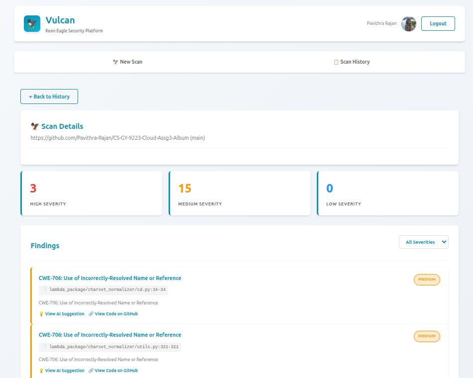
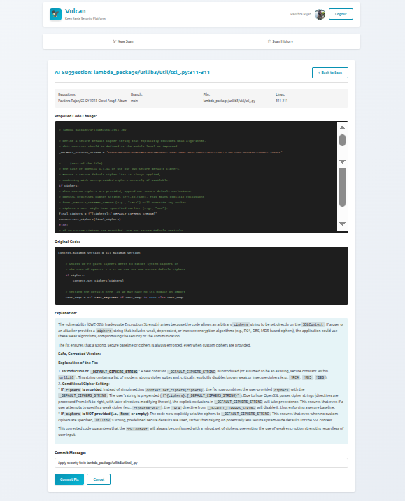

# User Interface
- The user interacts with the frontend by first logging into the application with GitHub OAuth and authorizing the app to access repositories. 
- Once authentication is successful, the user can select the repository from the drop down and choose a branch if needed. The branches in the repository are fetched as a drop down. This ensures that the request made to the backend correspond to a valid repository and branch. 

- After selecting the repository and branch, a `/scan/start` POST request is made which schedules a scanning of the repository by a fargate task. 
- A user can view the history of scans in the `Scan History` tab. 

- By choosing a particular scan, a user can get more details on the levels of vulnerabilities, its count, CWE/cause, file path, link to the code on GitHub and the AI suggestion to fix the issue. 

- By navigating to the AI suggestion, the user can view the proposed code change, original code, explanation of the vulnerability and how it will be fixed by the proposed change and an option to commit the fix. 
- A user can commit and also choose to revert the commit if they feel the change is not what they wish to do. 

